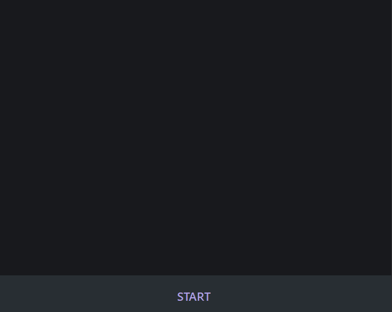
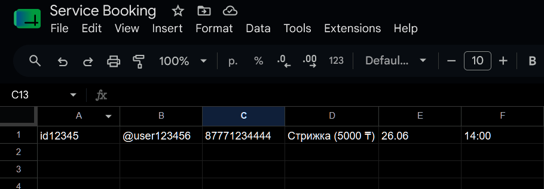

# Appointment Booking Telegram Bot

A Telegram bot for booking appointments with Google Sheets as the backend.

The bot guides users through the booking process, checks time slot availability, and stores reservations in a shared Google Spreadsheet.

> **Demo Bot**
>
> https://t.me/booking_temp_bot

---

**Demo**

User selects a service -> chooses a date and time -> enters a phone number -> the booking instantly appears in Google Sheets.





---

## Features

- Step-by-step booking flow
- Google Sheets integration
- Prevents double bookings
- Checks available time slots before confirmation
- Asynchronous request handling
- Multi-user support

---

## Tech Stack

- Python 3.11+
- aiogram 3
- gspread
- Google Sheets API
- aiosqlite (if used)
- python-dotenv

---

## Project Structure

```text
.
├── booking_bot.py
├── handlers/
├── keyboards/
├── states/
├── services/
├── database.py
├── google_sheets.py
├── config.py
├── requirements.txt
└── .env
```

---

## Installation

Clone the repository.

```bash
git clone https://github.com/dar-key/service-booking-bot.git
cd service-booking-bot
```

Create a virtual environment.

```bash
python -m venv .venv
```

Activate it.

Linux / macOS

```bash
source .venv/bin/activate
```

Windows

```powershell
.venv\Scripts\activate
```

Install dependencies.

```bash
pip install -r requirements.txt
```

---

## Configuration

Create a `.env` file.

```env
BOT_TOKEN=your_bot_token
SPREADSHEET_ID=your_google_sheet_id
```

Place your Google service account credentials in the project root.

```
credentials.json
```

---

## Google Sheets Setup

1. Create a project in Google Cloud Console.
2. Enable the **Google Sheets API** and **Google Drive API**.
3. Create a Service Account and download its JSON credentials.
4. Rename the file to `credentials.json`.
5. Share your spreadsheet with the Service Account email.
6. Copy the spreadsheet ID into your `.env` file.

---

## Run

```bash
python booking_bot.py
```

---

## License

MIT
